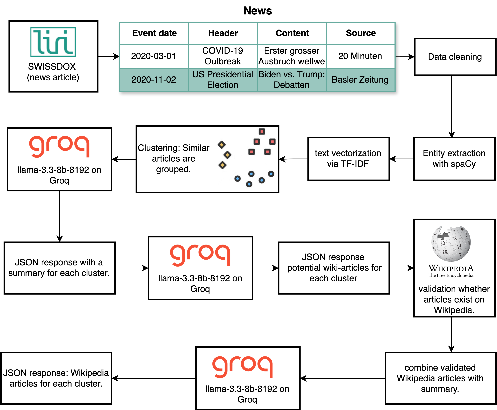

## Capturing the Flow of News into Wikipedia

Have you ever noticed how quickly Wikipedia seems to reflect major news events? Within days of a headline breaking, articles are updated, edited and expanded. But how exactly does that happen? The **WAVE engine** (short for Wikipedia Analysis and Verification Engine) was developed to trace this process, from published news articles to visible Wikipedia edits.

**Try it out yourself here:** [wave.fluehmann.earth](https://wave.fluehmann.earth/)

WAVE is not a real-time tool. It operates with a delay because the Swissdox API, its main news source, only provides articles two days after publication. This makes WAVE unsuitable for live monitoring, but it is well suited to studying how Wikipedia reacts to verified news coverage in a structured way.

## How WAVE Connects News and Wikipedia

Our system fetches German news articles from the Swissdox API for a specified date and groups them by topic. These clusters are summarised and linked to relevant Wikipedia pages. We tested three different approaches to find the best way to do this.

The **TEXT approach** converts each article’s headline and body into semantic vectors using the `all-MiniLM-L12-v2` model. Afterwards DBSCAN is used to group articles with similar content. These clusters are then summarised by the LLaMA 3 (8B)  language model, which also suggests Wikipedia article titles. Each suggested title is checked against Wikipedia to ensure it exists and matches the cluster summary before being saved.

The **SUM approach** uses the same clustering method but takes a different path by first creating a summary for each cluster before suggesting Wikipedia titles based on the summary.

The **NER approach** leverages SpaCy’s Named Entity Recognition to extract key names, places, and organisations, giving more weight to entities found in headlines. Articles are vectorised with TF-IDF, and clusters are created based on cosine similarity. Frequent entities within clusters guide the suggestion of Wikipedia titles, which are again validated before storage.

## Evaluation: What Worked Best?

To assess performance, the three methods were evaluated based on three criteria:

- **Thematic relevance** of the clusters
- **Accuracy of Wikipedia linking**
- **Quality of generated summaries**

These aspects were rated by human annotators on a scale of 1 (poor) to 5 (excellent). The table below shows the **median** scores for each method:

| **Criterion**                    | **TEXT** | **SUM** | **NER** |
|----------------------------------|:--------:|:-------:|:-------:|
| Thematic Relevance               |   4.0    |   5.0   |   5.0   |
| Relevance of Wikipedia Linking   |   3.0    |   4.5   |   3.5   |
| Summary Quality                  |   3.5    |   5.0   |   4.0   |

The **SUM approach** stood out for generating the most coherent summaries and the most relevant Wikipedia links. It benefited from the logical order of summarising first and linking second. The **NER method** excelled in creating tightly focused clusters, particularly when the articles shared clear references to people, organisations, or events. However, its linking performance was slightly more variable. The **TEXT approach** had the advantage of speed but often grouped unrelated articles or made weaker link suggestions.

## The Final Architecture: Combining Strengths

After careful evaluation, we built the final architecture by merging the most effective parts of the NER and SUM approaches.
On selected days, all relevant articles from that day are collected, cleaned, and deduplicated. SpaCy then extracts named entities, placing greater emphasis on terms found in headlines. Using TF-IDF, the articles are vectorised to capture thematic similarity, and grouped into clusters based on cosine similarity. Only clusters with enough articles and recurring key entities are kept for further analysis.

Each cluster is divided into smaller text chunks and summarised in parallel using the LLaMA 3 (8B) model. These partial summaries are then merged into a single, coherent overview for the entire cluster. From this summary, the system suggests relevant Wikipedia titles.

Before anything is stored, each suggested title goes through a two-step validation process: first, we check if the article exists on Wikipedia using its API; second, we verify whether its content aligns with the cluster summary. Only when both checks pass are the title and summary saved to the database. The figure below shows the pipeline and illustrates how WAVE links news clusters to Wikipedia articles.

  
*Figure: The WAVE pipeline links news clusters to Wikipedia.*

## What’s Next for WAVE?

WAVE offers a unique perspective on the flow of information from journalism into public knowledge bases like Wikipedia. Despite its two-day delay, it allows detailed tracking of how content evolves over time. Future improvements will focus on better disambiguation of names, expanding support for additional languages and media formats, and integrating other real-world knowledge sources.

Whether you are a researcher, a journalist, or simply curious about how collective knowledge develops, **WAVE provides an accessible and transparent way to explore this fascinating process.**

[WAVE Repository on GitHub](https://github.com/BDP25/WAVE.git)
