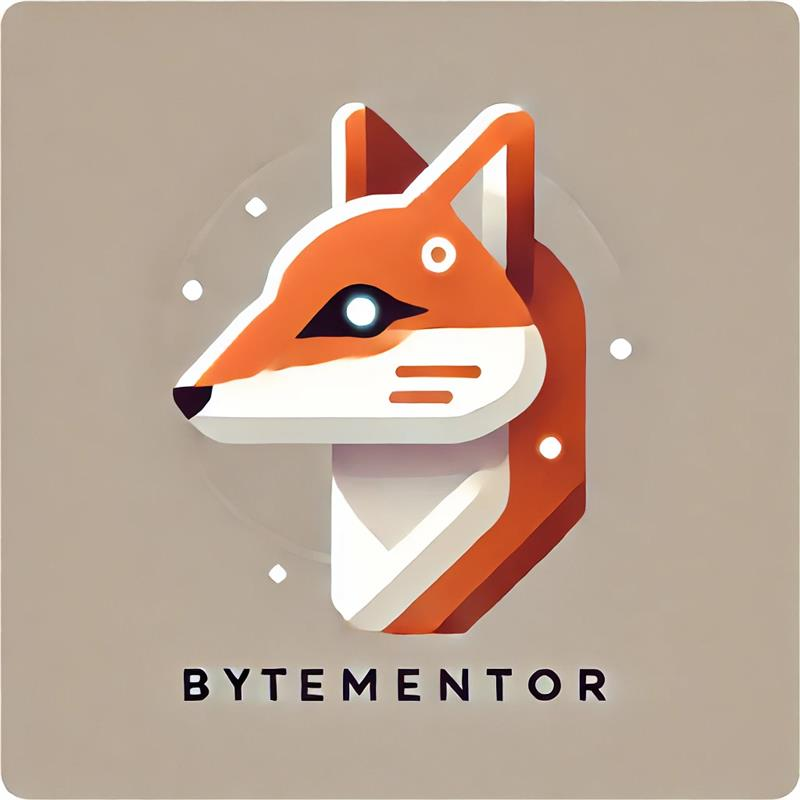
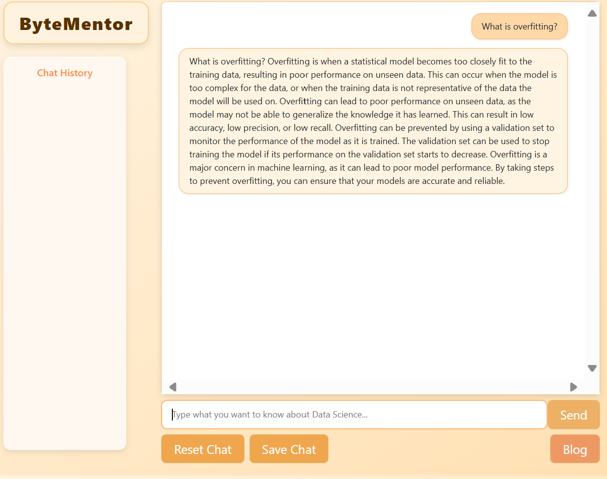

> Ein smarter Lernbegleiter für Data Science, entwickelt mit moderner KI und einer klaren Mission.

## Inhaltsverzeichnis
- [Einführung](#einführung)
- [Was macht ByteMentor besonders?](#was-macht-byteMentor-besonders)
- [Technische Magie im Hintergrund, einfach erklärt](#technische-magie-im-hintergrund-einfach-erklärt)
- [Für wen ist ByteMentor gedacht?](#für-wen-ist-bytementor-gedacht)
- [Was kommt als Nächstes?](#was-kommt-als-nächstes)

---

## Einführung

Was wäre, wenn du eine Frage zu Data Science stellst und anstatt eines trockenen Wikipedia-Artikels bekommst du eine verständliche, freundliche Antwort, die genau auf deinen Wissensstand abgestimmt ist? **Willkommen bei ByteMentor**.

ByteMentor ist kein gewöhnlicher Chatbot. Es ist ein smarter Lernbegleiter, der nicht nur antwortet, sondern auch mitdenkt und korrigiert. Entwickelt wurde das Projekt im Rahmen eines Data Science-studiums und ist ein Paradebeispiel dafür, wie moderne KI-Technologien und Nutzerfreundlichkeit Hand in Hand gehen können.

---

## Was macht ByteMentor besonders?

Stell dir vor, du schreibst: „Was ist Statistik Inference?“ **ByteMentor** versteht dich trotzdem, denn bevor deine Eingabe überhaupt verarbeitet wird, wird sie automatisch sprachlich verbessert.

Das geschieht mithilfe eines integrierten Korrekturdienstes, der grammatikalische und orthografische Fehler in Echtzeit korrigiert. Dann erst reagiert die KI mit einer passenden, verständlichen Antwort.

Und das ist noch nicht alles:

- **Chatverlauf speichern & laden**: Deine Gespräche gehen nicht verloren, ideal zum Wiederholen.
- **Fokus auf Data Science**: Trainiert auf Inhalte typischer Module.
- **Eigene KI-Modelle**: Nutzt ein angepasstes Modell basierend auf [Gemma](https://ai.google.dev/gemma?hl=de) mit [LoRA](https://github.com/microsoft/LoRA).
- **Verständnis echter Dokumente** *(in Arbeit)*: Integration von PDFs, Word- und PowerPoint-Dateien ist geplant.

---

## Technische Magie im Hintergrund, einfach erklärt

Im Herzen von **ByteMentor** steckt eine moderne Web-App mit einem intuitiven Chatfenster.

Sie basiert auf **React** und kommuniziert mit einem **Flask-Backend**, das Korrektur- und KI-Funktionalität bereitstellt.

Eine besonders clevere Komponente ist das sogenannte **Merged Model**, das durch den [LoRA-Adapter](https://huggingface.co/docs/peft/main/en/developer_guides/lora) auf spezifische Inhalte getrimmt wurde.

Beispielhafte Fragen:

- „Was ist Overfitting in Machine Learning?“
- „Und wie erklärt man das konkret im Modul ZHAW-DataScience?“

**ByteMentor** liefert auf beide Varianten passende Antworten, klar, verständlich und kompakt.

---

## Für wen ist ByteMentor gedacht?

**ByteMentor** richtet sich an:

- Studierende, die sich auf Prüfungen vorbereiten wollen
- Selbstlerner, die Data Science entdecken möchten
- Neugierige, die lieber Fragen stellen als lange Artikel zu lesen

Kurz: Alle, die lernen möchten, ohne Fachchinesisch, aber mit Tiefgang.

---

## Was kommt als Nächstes?

**ByteMentor** steht noch am Anfang, aber die Vision ist groß:

- Integration in Lernplattformen
- Unterstützung für weitere Sprachen
- Vielleicht sogar eine mobile App

> Gemeinsam machen wir Lernen einfacher, klarer und ein bisschen intelligenter.

*Stand: 20.05.2025  
Bearbeitet von: azevekat, schwadam, tomicnik*

[ZHAW – Zürcher Hochschule für Angewandte Wissenschaften](https://www.zhaw.ch/de/hochschule)
