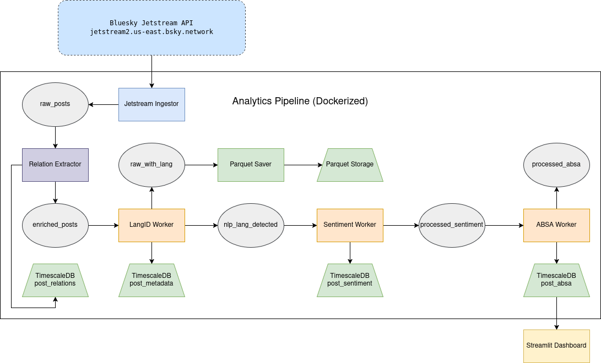

Access to social media data is increasingly restricted. Platforms like X (formerly Twitter), Facebook, or TikTok limit or monetize API access, making real-time research difficult or impossible. Public discourse happens behind walls, and third-party tools often rely on scraped or outdated data.

[Bluesky](https://blueskyweb.xyz/) breaks that pattern. Thanks to its decentralized architecture ([AT Protocol](https://atproto.com/)) and the [Jetstream API](https://github.com/bluesky-social/atproto/tree/main/packages/api), it offers open access to a continuous stream of public posts — no paywalls, no API keys. We used this opportunity to build a real-time analytics pipeline from scratch, using only open-source tools. Our goal was to explore what becomes possible when you regain full control over the data — from ingestion to visualization.

## Our Pipeline at a Glance

We designed a modular, containerized system that ingests, enriches, stores, and visualizes millions of Bluesky posts per day. It supports near real-time performance while remaining scalable and fault-tolerant. The architecture is built around decoupled components communicating via Kafka, which allows each service to be restarted, scaled, or swapped independently.

The pipeline includes:

- [**Jetstream API**](https://github.com/bluesky-social/atproto/tree/main/packages/api) + [**Apache Kafka**](https://kafka.apache.org/) for ingestion and event routing  
- [**langdetect**](https://pypi.org/project/langdetect/) for language detection (CPU)  
- [**distilbert-base-uncased-finetuned-sst-2-english**](https://huggingface.co/distilbert-base-uncased-finetuned-sst-2-english) for sentiment analysis (GPU)  
- [**yangheng/deberta-v3-base-absa-v1.1**](https://huggingface.co/yangheng/deberta-v3-base-absa-v1.1) for ABSA (GPU)  
- [**Apache Parquet**](https://parquet.apache.org/) for long-term raw data storage  
- [**TimescaleDB**](https://www.timescale.com/) for structured, time-series-optimized metadata  
- [**Streamlit**](https://streamlit.io/) for live ABSA sentiment visualization

All components are orchestrated via [Docker Compose](https://docs.docker.com/compose/). We run multiple workers in parallel — for instance, separate containers for ABSA and sentiment tasks — to leverage GPU resources efficiently. Under load, the system processed up to **12,000 posts per minute**, confirming its robustness even during backlog recovery.

## Dashboard and ABSA Focus

Our dashboard, available at [bd.fs0.ch](https://bd.fs0.ch), focuses exclusively on **aspect-based sentiment analysis**. Rather than just tagging posts as positive or negative, ABSA allows us to capture how specific **entities** are perceived over time. These entities are curated in a list and include key concepts, people, technologies, or organizations mentioned in posts.

This enables more granular insights than conventional sentiment scores. For example, we can detect that "AI regulation" is viewed negatively while "open-source models" are discussed more positively — all within the same post stream. The results are updated continuously and stored in a time-indexed PostgreSQL/TimescaleDB backend.

The dashboard provides a simple but powerful interface to filter by entity, date, and sentiment type. It is lightweight, browser-based, and built entirely with Streamlit. All data shown is derived from our internal Kafka pipeline and the corresponding ABSA hypertable in TimescaleDB.

## Handling Large Threads

One of the strengths of Bluesky is that it exposes conversation structure directly. Every post includes metadata such as `parent_id`, `root_id`, and `repost_id`. Using this, we implemented a relation extractor that builds the full thread tree — including deep nested replies and reposts.

In one use case, we ingested and analyzed a discussion on large language models (LLMs) containing **over 10,000 posts**. Despite its size and complexity, our system was able to reconstruct the entire tree and compute sentiment trajectories per entity across time. This goes far beyond hashtag analysis — we can observe how ideas develop, how polarizing topics evolve, and where sentiment shifts occur within threads.

## What’s Next?

The next phase of our project shifts from infrastructure to **content-level analysis and knowledge enrichment**. While the current system enables real-time monitoring of sentiment and entities, the next step is to **identify emerging scientific and technological topics** — and enrich them with relevant background information.

On platforms like Bluesky, discussions frequently arise around newly published papers, AI models, or technical developments. We aim to detect these topics as they emerge — typically through **mention spikes of specific entities** — and automatically augment them with context. This includes:

- Abstracts from sources like [arXiv](https://arxiv.org/)  
- Related discussions or historical references

To achieve this, we will extend our pipeline with:

- A **spike detection module** using TimescaleDB and Kafka  
- A **semantic retrieval engine** built on vector databases like Qdrant  
- **Entity-driven embedding pipelines**, enabling topic-specific matching  
- A lightweight dashboard that visualizes the current thematic landscape

Technically, this will combine streaming data analysis, NLP-based entity tracking, and **Retrieval-Augmented Generation (RAG)**. Over time, we plan to develop modular domain models (e.g. for AI, climate science, or biomedicine), enabling the system to adapt to different areas of discourse.

This next step is not just a technical challenge — it’s a step toward **automated sense-making** in open social data streams.

## Try It Yourself

- 🔎 **Live dashboard**: [bd.fs0.ch](https://bd.fs0.ch)  
- 💻 **Codebase (cleaned)**: [github.com/BDP25/BlueskyDashboard](https://github.com/BDP25/BlueskyDashboard)

We built this system to show that open, real-time social media analytics are still possible — and maybe more important than ever. Bluesky offers a rare opportunity to rethink how we measure and interpret public discourse. This is our small contribution to that future.
